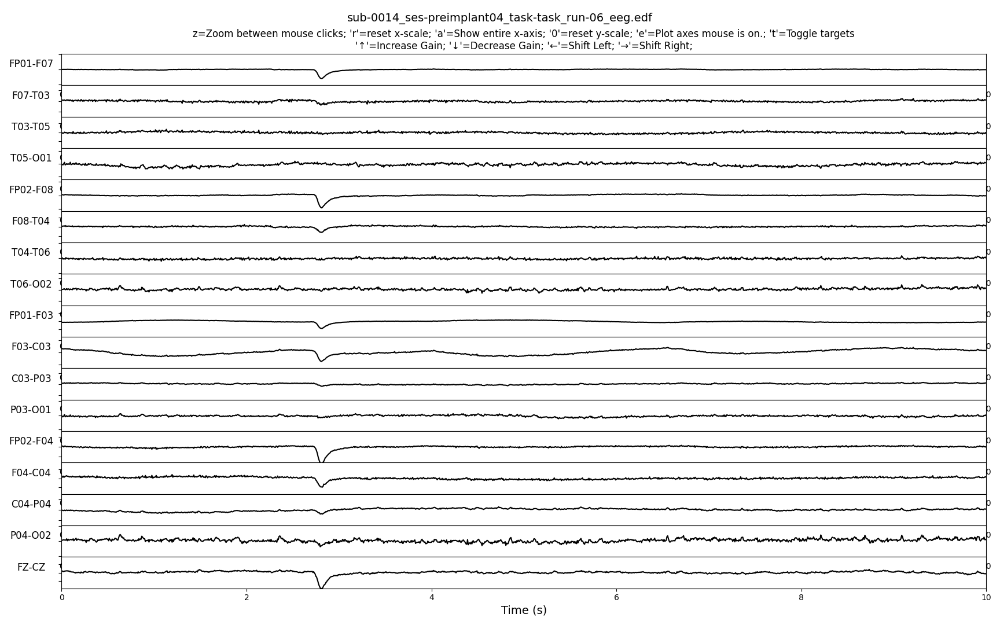
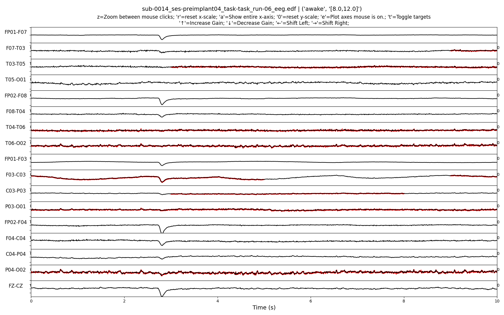
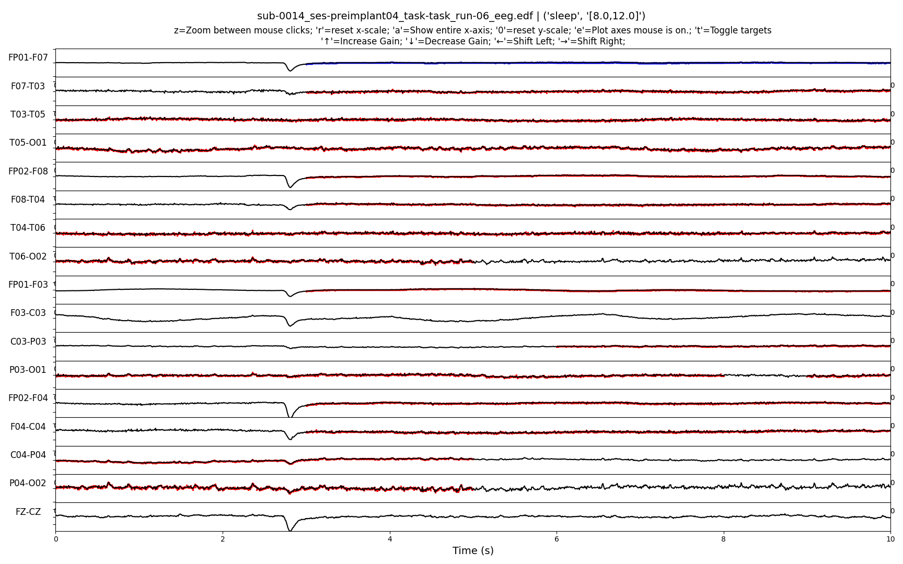
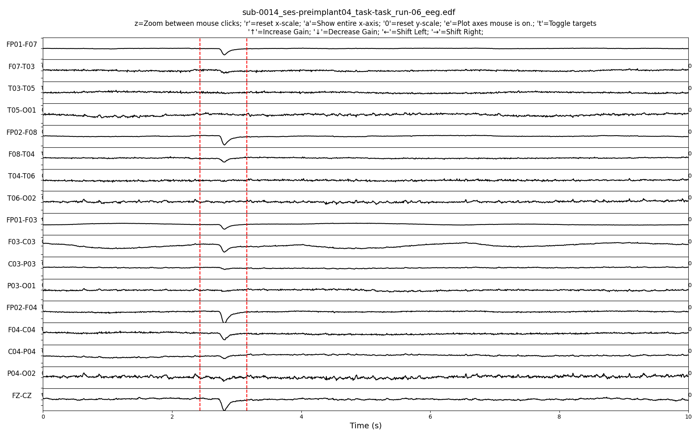
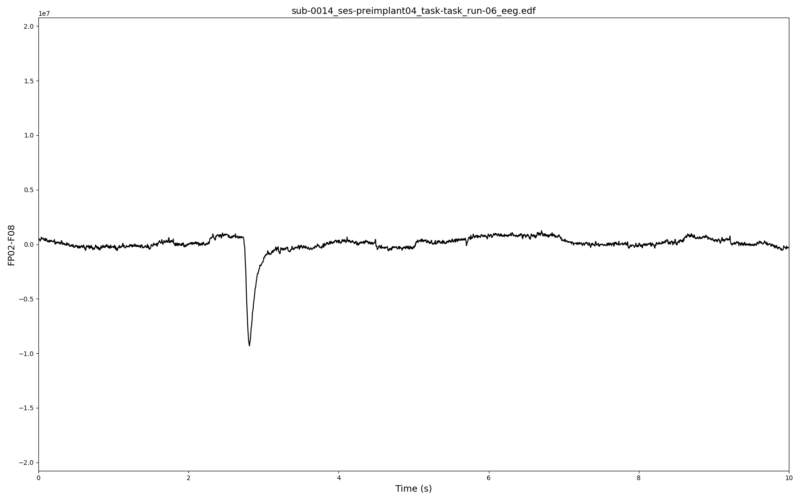

# Data Visualizations

## EDF Viewer

We provide a light-weight means of visualizing EDF data in a Python environment. An example instantiation of the code is as follows:

```
utils/visualization/edf_viewer.py --file ../../user_data/BIDS/BIDS/sub-0014/ses-preimplant04/eeg/sub-0014_ses-preimplant04_task-task_run-06_eeg.edf --sleep_wake_power ../../user_data/derivative/sleep_state/timeseries_association/reference.pickle
```
where:
- file: Is the edf file to be read in
- sleep_wake_power: Optional flag that tags timeseries data.
    - The viewer allows tagging of timeseries data points to draw attention to areas of interest. This flag reads in sleep/wake annotated data. 

### Example Views
The default view for an EDF file following channel name cleanup and montaging might look like the following:


In this next example, by using the `t` button, we can highlight timepoints that might be of interest. In this case, we have data of interest in a sleep/wake study.


If we press t again, we can go to another series of timepoints of interest. We can also have multiple categories of interesting points, which results in different highlighting colors.


If we wish to zoom in on the data, we can left click to define an area of interest:


And by pressing `z` we can zoom in on that region (and reset the zoom by pressing `r`):


Finally, if we wish to look at just one channel closely, we can hover over the timeseries and press `e` to get a full plot zoom in:

