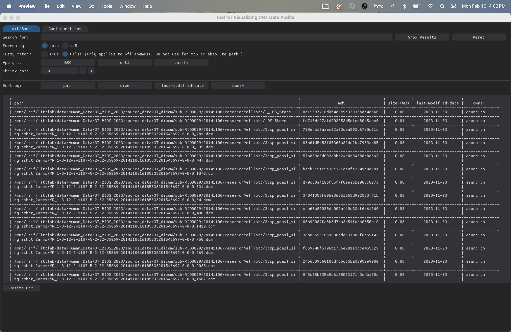

# Data Audit Tool

Due to the increasing data volume, regular data audits are required to remove duplicate data and identify non-essential data to send to deep storage. This tool is meant to help staff interact with audit data in an easier format.

## Audit Fields

The audit tracks five individual fields for the end-user to explore:

1. **path** The fullpath to a file on the given computer system.
2. **md5** A cryptographic sum that represents data within a file. This is basically the fingerprint of the file, and allows us to find matching files regardless of their host system or filename.
3. **size** The filesize in MB.
4. **Last Modified Date** Last modification date for the file.
5. **owner** Owner of the file.

## Layout

The above is an example view of the data audit gui. An explanation of each field follows:

- **Search for:** This field accepts alphanumeric input and will search the data audit for any results that (nearly) match the provided string. The behavior of how this string can be used is explained in following fields.
- **Search by:** This radio button sets whether you wish to look for your search entry within the file path, or by md5.
    - Since an md5 value is a unique value for each file, a near match does not mean a nearly similar file.
    - It is recommended to search by a complete md5, or enter an exact substring of a known md5 checksum to find any matches across systems.
- **Fuzzy Match:** This radio button toggles fuzzy string matching filenames. Fuzzy matching is a means of finding nearly similar strings, and can be used if you expect the filenames you are searching for may be close to your inputted string, but not exact.
    - This option is slower than an exact match. Use only as needed.
- **Apply to:** Apply the above settings to the data tables for the selected computer system.
- **Shrink Path:** Due to the long filepaths, this shrinks/collapses the folders in the filepath. The larger the number, the more top level folders are hidden from the display.
- **Sort by:** Sort the table values by the selected field. Clicking multiple times toggles between ascending and descending values.

## Installation

1. Download and install anaconda.
2. Install the needed python environment using the provided environment file.
    > conda env create --file envs/cnt_audit.yml 
3. Activate the conda environment
    > conda activate cnt_audit
4. Run the code
    > python AUDITGUI.py

## Modifying the default filepaths

As this is still in development, we do not have a static location for the audit files yet. Please check your email if you are part of the project for where to obtain a sample audit file.

You can change the path the GUI tries to find the data by editing the following file: [config/auditpaths.yaml](../config/auditpaths.yaml)
